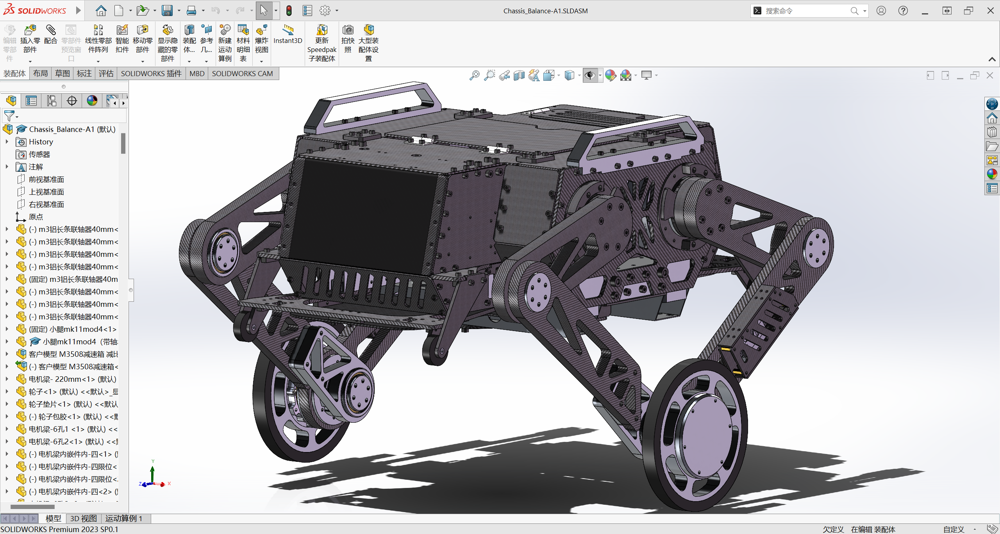
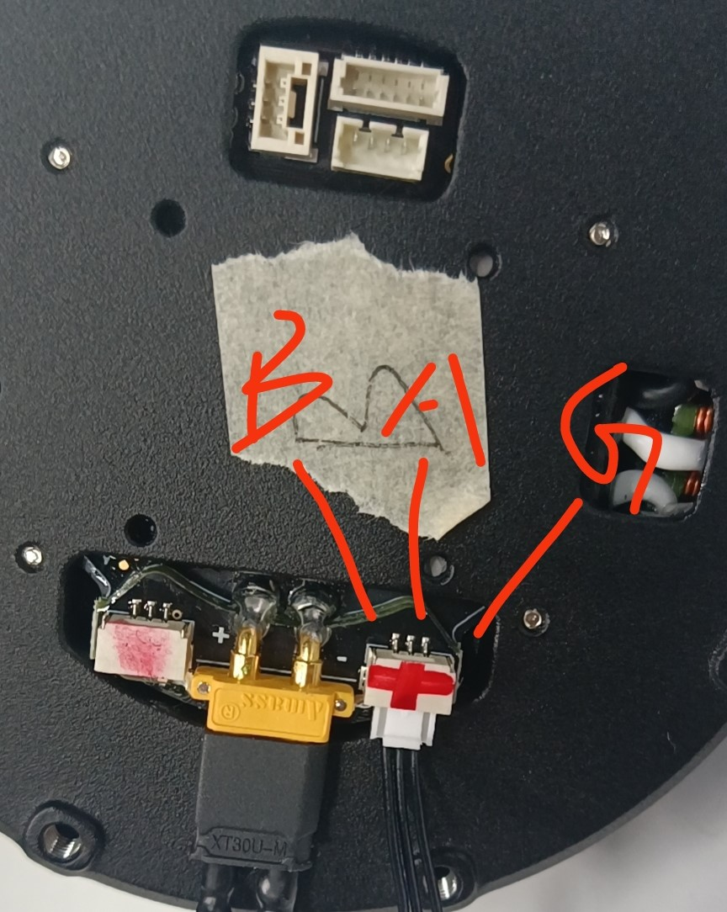
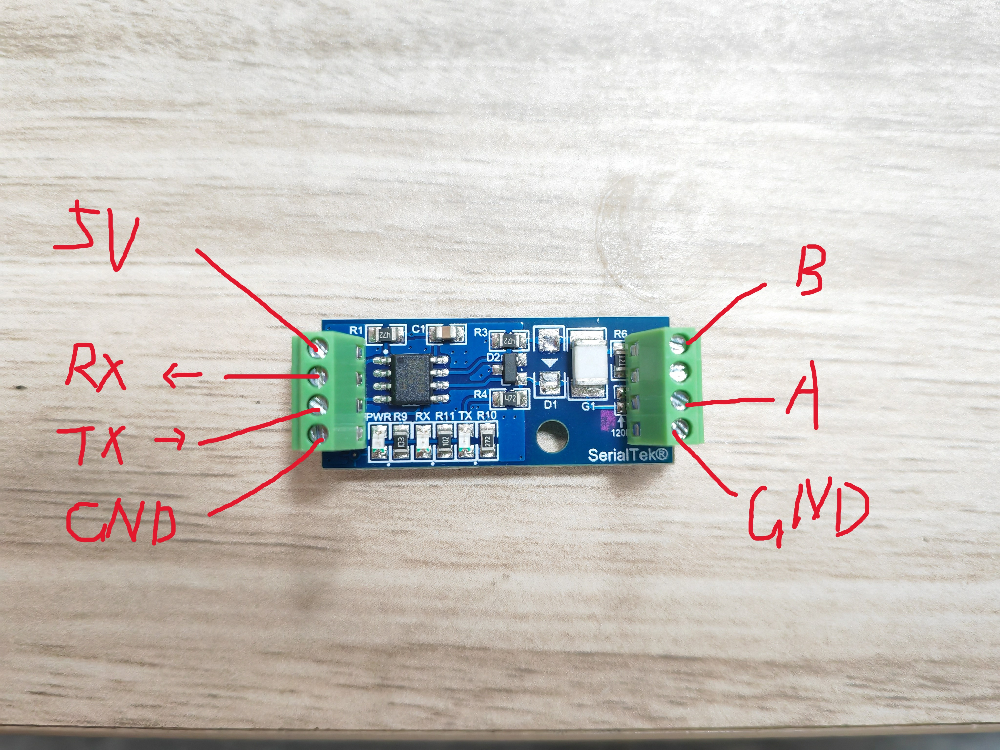

# Wheel legged robot——Main_Code
## 轮足机器人项目简介(详情见技术报告)
***

  

    轮腿机器人模型渲染预览图

***
## 目录
### 1. [机械部分](#mechanical)
### 2. [硬件部分](#hardware)
### 3. [电控部分](#codeid)
### 4. [研发日志](#test)
***
## 1. 机械部分 
### 1.1图纸预览

  

    solidworks装配图纸(2023版sw)

### 1.2主要参数

| 部件            | 重量 kg  | 尺寸 mm           |
|---------------|--------|-----------------|
| 总质量           | 12.900 |                 |
| 主体            | 9.500  |                 |
| 连杆质量(一侧不含驱动轮) | 1.626  |                 |
| 3508改减速箱      | 0.334  |
| 轮子            | 0.396  | 75mm 半径         |
| 驱动轮总重         | 0.730  | 75mm 半径         |
| 虚拟腿长          |        | 95.51mm~398.1mm |

### 1.3机械设计
- **主体框架**：
- **关节部分**：
    - 大腿和小腿连接关节：
    - 轮毂电机与小腿连接关节：
- **腿部设计**：
  - 关节电机间距150mm，大腿长150mm，小腿长270mm
  - 以水平面为零度，大腿的活动范围为-80°~40°
  - 虚拟腿长范围为95.51mm~398.1mm

## 2. 硬件部分 
### 2.1主控外观图

  

  

    主控3D模型图

- 使用嘉立创EDA绘制，4层板，可用券免费打板。
### 2.2主要参数
- 使用STM32H723VGT6芯片
- 支持10-31V宽电压输入
- 带有防反接电路，防呆又防傻
- 带有两个可控的电源输出口
- 板载CH340芯片，C口可用于与上位机通信(USART1)
- 三路CAN
- 一个复位键一个用户自定义按键
- 三路PWM输出可直接接舵机
- 一个SBUS接口
- 8个串口接口、3个I2C接口
- 7个用户自定义led
- 一颗FLASH芯片提高容量
### 2.3设计思路
- **接口**：在设计之初便考虑到主控需要连接串口陀螺仪、ELRS接收机和电机等外设，尤其是为了使宇树A1的控制频率达到1000hz，需要单独一个串口控制一个宇树A1，因此需要大量的串口，故在主控设计时尽量将所有的串口引出来。
- **LED灯**：为了方便观察主控与模块通讯的频率，便在主控上添加了7个led灯，四个用于指示与四个宇树A1的通讯状态，一个用于指示与串口陀螺仪的通讯状态，一个用于指示与ELRS接收机的通讯状态，最后一个用于指示程序是否在正常运行。
- **其他电路设计**：
    - 通过滤波电容和TVS提高输入电源的质量
    - 采用稳压二极管和NMOS实现防反接电路
    - 单独使用一颗TPS5450芯片为舵机提供驱动电源，并在输出部分并联大电容提供足够的电流
    - 两个可控的电源输出(输出电压与输入电压相同)，提高其他外部设备可控性

## 3. 电控部分 
- **开发工具为`STM32CubeMX`+`Clion`+`Vofa+`**

### 3.1电机选型
- **关节电机**：宇树A1
    - 通信方式：RS485 (需要使用 TTL 转 RS485 模块驱动)
    - 连接方式：一个串口连接一个电机实现控制频率到达1000hz
    - 单编码器(需要使用机械限位，每次上电回抽腿，碰到机械限位记为零位)
    - [A1数据手册](picture/A1shuju.pdf)
    - [A1使用手册](picture/A1shiyong.pdf)
- **轮毂电机**：DJI 3508
    - 通讯方式：CAN通讯
    - 单编码器
    - [M3508手册](picture/M3508.pdf)

  

    A1的485口接线顺序

  

    串口转485接线顺序

### 3.2开启的外设
| 外设      | 描述                     |
|---------|------------------------|
| USART3  | 宇树A1电机                 |
| UART9   | 宇树A1电机                 |
| UART4   | 宇树A1电机                 |
| UART7   | 宇树A1电机                 |
| USART6  | 与无线DAPlink连接实现在上位机打印数据 |
| USART2  | 串口陀螺仪                  |
| USART10 | ELRS接收机                |
| USART8  | 屏幕驱动板                  |
| CAN1    | 3508轮毂电机               |
| CAN2    | 3508轮毂电机               |

### 3.3任务说明
- `Devices`:
    - `Motor_A1`:
    - `HI91`:
    - `ELRS_Control`:
    - `Dji_motor`:
      - 手册中M3508的减速比为19：1时转矩常数为0.3N*m/A,C620控制的电流值范围为-16384~0~16384，对应电流为-20~0~20A，轮毂电机我更换为减速比268：17的减速箱，因此代码中输出扭矩与电流值的关系为：T = (201/661504)*电流值
- `App`:
    - `Check`:
    - `Control_Logic`:
    - `Hardware_Config`:
    - `USART_Callback`:
- `BSP`:
    - `can_bsp`:
## 4. 研发日志 
- **2024.10.01**：开始绘制机械机构，参照2023上交开源的平衡步兵。
- **2024.11.01**：修改关节轴承为自行车用的碗组轴承。
- **2024.11.03**：绘制完成主控原理图。
- **2024.11.04**：绘制主控PCB图。
- **2024.11.05**：开始绘制电源管理模块。
- **2024.11.09**：绘制完成主控PCB。
- **2024.11.10**：绘制完成电源管理模块PCB。
- **2024.11.15**：修改电源管理模块。 修改图纸导轮部分。
- **2024.11.16**：修改图纸关节部分关键CNC零件并外发。
- **2024.11.17**：研究ELRS遥控器，写CRSF协议代码，耗时一整天写出了大概可以用的代码，但是接收到的数据是乱的，但是会周期性出现正确顺序的数据，虽然遥控可以用但是帧率不稳定，目前优化方向主要是遥控器和接收机的设置，同时代码仍需优化。
- **2024.11.19**：焊接主控两块，其中一块短路，经过长时间排查发现问题在电源输入端的防反接电路，在焊接mos时锡加多了，导致栅源极短路，解决后不再短路，但是上电后电流跑到了3A多，给主控电路供电的TPS5450发烫冒烟，更换后电路板正常。
- **2024.11.20**：修改电源管理模块思路，决定使用AD7076模块来进行采样电流，还需要等模块到了进行测试，使用h7自带的adc采集电压，不同采样通道是否会相互干扰需要进一步测试，pcb板需要修改。
- **2024.11.22**：修改遥控器接收为串口空闲中断，这次接收到的数据不再混乱，遥控器帧率大大提升。
- **2024.11.23**：测试自制主控BMI088不可以使用，重焊多次仍无法正常使用，最后决定使用外置串口陀螺仪。测试可控24v输出可以正常使用。
- **2024.11.25**：测试自制主控CAN1和CAN2，测试过程中CAN1可以正常使用，CAN2不可以正常使用，检查发现是cubemx配置有问题，其中一块板子120R电阻焊错，更正后CAN2可以正常使用，CAN3暂时未测，CAN3比较特殊和其他两个CAN有所不同。
- **2024.11.27**：测试陀螺仪，将陀螺仪频率设置为1000hz，代码已写完，需上板测试。
- **2024.12.03**：修改大腿为15mm。外发碳板，暂停腿车项目，直到考试结束。
- **2024.12.16**：给3508转子更换减速箱，不论怎么安装当齿轮转到固定位置阻尼会变大，尝试多次后决定把电机和减速箱寄给商家安装维修。
- **2024.12.17**：研究宇树A1电机，使用例程转不起来电机，检查线路和更换串口转RS485模块（模块需支持4.8Mbps，原来的模块很便宜不支持，于是重新购买更换串口转RS485模块）均不能转起来，最终发现波特率少打了个0。出现发送命令电机抖动一下，修改数据包中ModifyBit为0xFF即可解决问题。
- **2024.12.18**：测试串口陀螺仪，可能是因为波特率921600很高，平时可以正常使用的串口空闲中断不断出问题，多次复位才能有几次接收到数据，并且bug不断，修改中断优先级也无果，最后发现应该是初始化一次打开空闲中断后，极其容易串口出错从而进入串口错误回调函数，同时关闭dma和串口接收中断，通过在串口错误回调函数里添加初始化函数解决问题，经测试发现总共会有1-5次进入串口错误回调函数，出错大概率在板子刚上电的时间段内。解决这个问题后，发现进入回调函数的频率只有100hz左右，这与设置的1000hz相差甚远，误打误撞发现把DMA设置为普通模式解决问题，频率来到了800hz左右，但是crc校验一直过不了，最后对比手册里的例程修改后，完美实现crc校验后1000hz的频率。解决该问题后，发现解算的数据完全不对，检查代码后发现空闲中断初始化函数里缓存区大小需要设置成一帧的字节数，数据不再乱跳，后面又对float型数据转换进行修改，最终完美实现串口陀螺仪1000hz接收正确的陀螺仪数据。
- **2024.12.19**：给陀螺仪和主控画外壳并调试。
- **2024.12.20**：卖家提供的A1例程纯依托，参照别人分享的例程修改可读性和效果更好的代码。并修改第二版主控外发。
- **2024.12.21**：修改封装并测试完毕用于整个腿车工程的宇树A1驱动代码，采用一个串口控制一个电机的方案，实现对电机的1000hz控制。
- **2024.12.22**：移植商家屏幕的代码，商家代码很抽象，HAL库不像HAL库，像标准库，移植废了很大劲，虽然移植成功，但是移植的代码比较混乱，需要后续好好阅读并修改。
- **2024.12.23**：测试不同表情显示，总体表情显示方案确定，后续优化表情显示使其更加生动形象一些。
- **2024.12.24**：装配。
- **2024.12.25**：装配，布线。
- **2024.12.26**：装配基本完成，布线。
- **2024.12.27**：布线。
- **2024.12.28**：布线。
- **2024.12.29**：布线基本完成，可以开始调试代码。
- **2024.12.30**：重新将装配错误的地方安装，优化布线。
- **2025.01.02**：绘制腿部C610电调保护。
- **2025.01.06**：安装C610电调保护，并优化布线。
- **2025.01.13**：测试elrs遥控器接收代码，测试帧率可达840hz左右。在同时测试打开四个关节电机和串口陀螺仪的串口时，帧率可达1000hz，但是偶尔出现帧率降到70左右，同时代码运行很慢，推测可能是DMA缓存区溢出或中断处理不及时，最终通过在CORTEX_M7配置MPU打开Cache充分发挥h7芯片的性能解决。
- **2025.01.14**：编写VMC和屏幕代码。
- **2025.01.21**：完善VMC并验证，编写完成两条腿的控制代码，需验证。
- **2025.01.22**：校准电机和参数极性，腿车落地测试，终于可以站立起来并且保持平衡，但在最初的测试中发现，在前进和后退的过程中，腿的摆角和机体姿态的摆动方向正确，但是机体摆动幅度过大导致机体过于倾斜，最终查明原因是在matlab计算增益矩阵的参数里，机体质心距离转轴距离给的过大，修改后机体运动正常，但是在调试的过程中发现了很多问题：1.elrs接收机串口有时候会收不到数据，可能是串口出问题了？复位后可以解决。2.机体运动一段时间会抽搐，关遥控器再打开就好了，问题正在寻找中。3.修改代码时，一些明显没有问题简单的修改，会直接导致单片机卡死。
- **2025.01.26**：将相应的串口dma中断优先级提高后解决elrs接收机串口有时候会收不到数据的问题。在2024.1.13出现了奇怪问题，通过配置MPU打开Cache解决，但是在后续完善代码调试的过程中，发现腿车有时候会抽搐，在今天的debug中发现还是老问题，在重重努力之下终于解决：最初我开cache是为了用DTCM这个内存，这是一个高速内存，他和内核的频率一样能到480mhz，其他内存也就不到200mhz，Clion在每次编译完之后会显示各个内存占用，我发现他默认使用RAM_D1，keil5默认使用的是DTCM，于是我就修改ld文件，将里面的RAM_D1替换为DTCMRAM，就可以默认使用DTCM了，但是DMA是不能访问DTCM的内存地址的，因此需要在ld文件里添加   ._D1_Area :   {   . = ALIGN(4);   . = ALIGN(4);   } >RAM_D1 这几行代码，然后在定义变量的时候__attribute__((section("._D1_Area"))) uint8_t elrs_data_temp[36] = {0};这样写，就可以把使用DMA的变量存储在RAM_D1中，这样子大大提高了代码的运行效率，成功解决问题，但此时编译生成的bin文件特别大，有足足448M，需要修改为  
._D1_Area(NOLOAD) :
  {
  . = ALIGN(4);
  KEEP(*(._D1_Area))
  . = ALIGN(4);
  } >RAM_D1
即可解决。修改了DSP库文件位置，并修改了CMakeLists_template里的配置，这样子使用Cubemx重新生成代码的时候不会将CMakeLists里已经修改的配置顶掉。 

