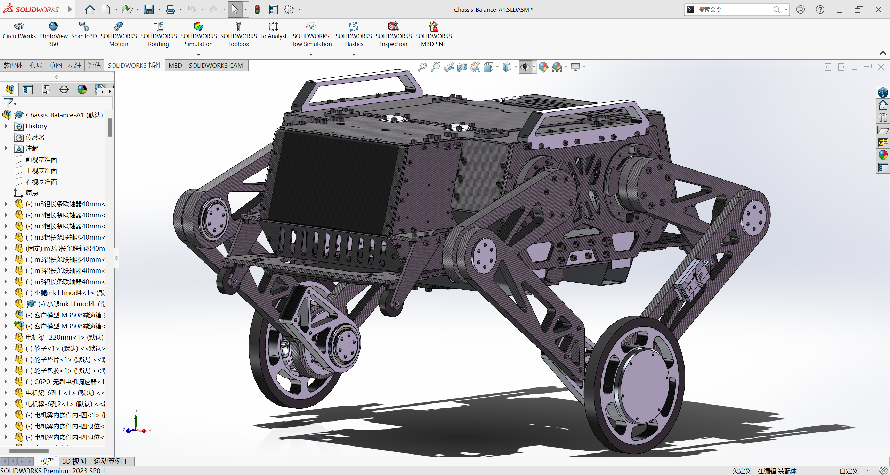
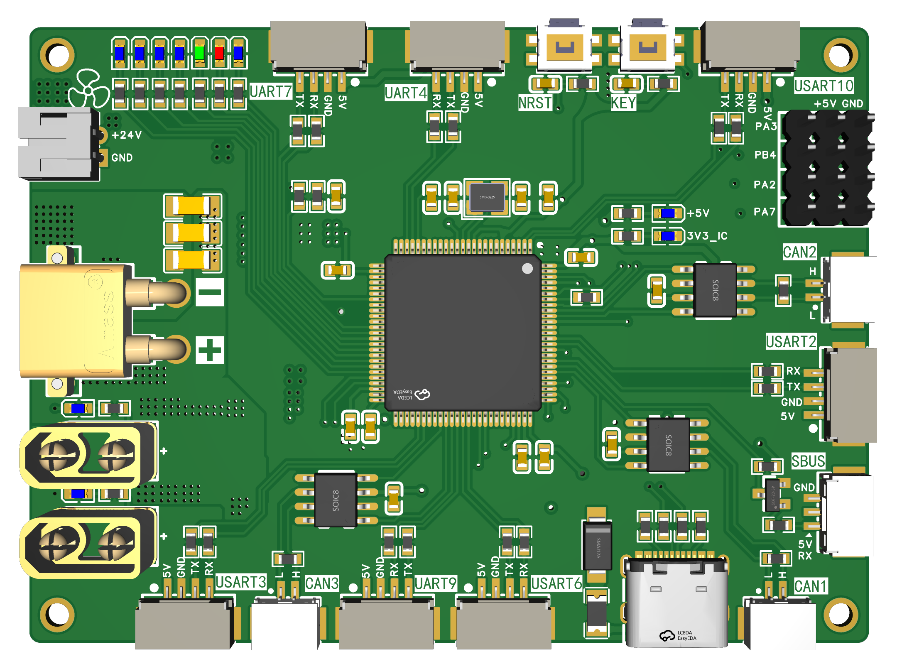
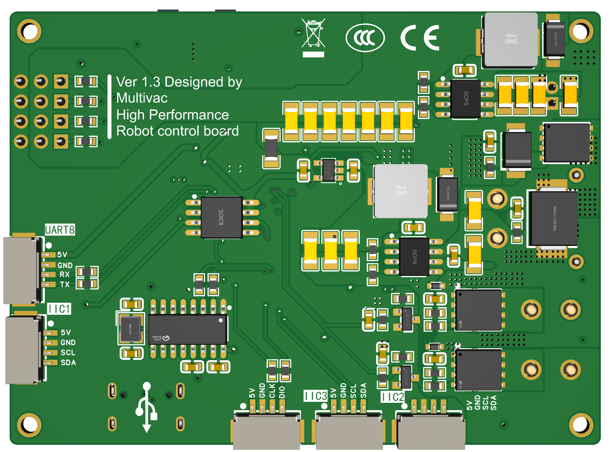

# Wheel legged robot——Main_Code
## 轮足机器人项目简介(详情见技术报告)
***

  

    轮腿机器人模型渲染预览图

***
## 目录
### 1. [机械部分](#mechanical)
### 2. [硬件部分](#hardware)
### 3. [电控部分](#codeid)
***
## 1. 机械部分 
### 1.1图纸预览

  

    solidworks装配图纸(2023版sw)

### 1.2主要参数

| 部件            | 重量 kg  | 尺寸 mm  |
|---------------|--------|--------|
| 总质量           | 12.900 |        |
| 主体            | 9.500  |        |
| 连杆质量(一侧不含驱动轮) | 1.626  |        |
| 3508改减速箱      | 0.334  |
| 轮子            | 0.396  | 75mm 半径 |
| 驱动轮总重         | 0.730  | 75mm 半径 |
| 虚拟腿长          |        | 待测     |

### 1.3设计思路
- **主体框架**：
- **关节部分**：
    - 大腿和小腿连接关节：
    - 轮毂电机与小腿连接关节：
- **腿部设计**：

## 2. 硬件部分 
### 2.1主控外观图

  

  

    主控3D模型图

- 使用嘉立创EDA绘制，4层板，可用券免费打板。
### 2.2主要参数
- 使用STM32H723VGT6芯片
- 支持10-31V宽电压输入
- 带有防反接电路，防呆又防傻
- 带有两个可控的电源输出口
- 板载CH340芯片，C口可用于与上位机通信(USART1)
- 三路CAN
- 一个复位键一个用户自定义按键
- 三路PWM输出可直接接舵机
- 一个SBUS接口
- 8个串口接口、3个I2C接口
- 7个用户自定义led
- 一颗FLASH芯片提高容量
### 2.3设计思路
- **接口**：在设计之初便考虑到主控需要连接串口陀螺仪、ELRS接收机和电机等外设，尤其是为了使宇树A1的控制频率达到1000hz，需要单独一个串口控制一个宇树A1，因此需要大量的串口，故在主控设计时尽量将所有的串口引出来。
- **LED灯**：为了方便观察主控与模块通讯的频率，便在主控上添加了7个led灯，四个用于指示与四个宇树A1的通讯状态，一个用于指示与串口陀螺仪的通讯状态，一个用于指示与ELRS接收机的通讯状态，最后一个用于指示程序是否在正常运行。
- **其他电路设计**：
    - 通过滤波电容和TVS提高输入电源的质量
    - 采用稳压二极管和NMOS实现防反接电路
    - 单独使用一颗TPS5450芯片为舵机提供驱动电源，并在输出部分并联大电容提供足够的电流
    - 两个可控的电源输出(输出电压与输入电压相同)，提高其他外部设备可控性

## 3. 电控部分 
- **开发工具为`STM32CubeMX`+`Clion`+`Vofa+`**

### 3.1电机选型
- **关节电机**：宇树A1
    - 通信方式：RS485 (需要使用 TTL 转 RS485 模块驱动)
    - 连接方式：一个串口连接一个电机实现控制频率到达1000hz
    - 单编码器(需要使用机械限位，每次上电回抽腿，碰到机械限位记为零位)
- **轮毂电机**：DJI 3508
    - 通讯方式：CAN通讯
    - 单编码器

  

    A1的485口接线顺序

  

    串口转485接线顺序

### 3.2开启的外设
| 外设      | 描述                     |
|---------|------------------------|
| USART3  | 宇树A1电机                 |
| UART9   | 宇树A1电机                 |
| UART4   | 宇树A1电机                 |
| UART7   | 宇树A1电机                 |
| USART6  | 与无线DAPlink连接实现在上位机打印数据 |
| USART2  | 串口陀螺仪                  |
| USART10 | ELRS接收机                |
| USART8  | 屏幕驱动板                  |
| CAN1    | 3508轮毂电机               |
| CAN2    | 3508轮毂电机               |

### 3.3任务说明
- `Devices`:
    - `Motor_A1`:
    - `HI91`:
    - `ELRS_Control`:
    - `Dji_motor`:
- `App`:
    - `Check`:
    - `Control_Logic`:
    - `Hardware_Config`:
    - `USART_Callback`:
- `BSP`:
    - `can_bsp`:

